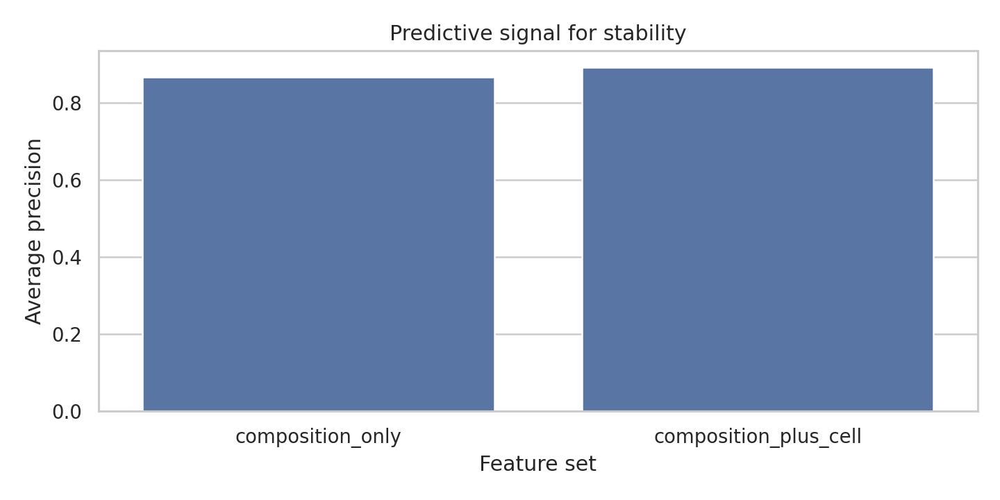
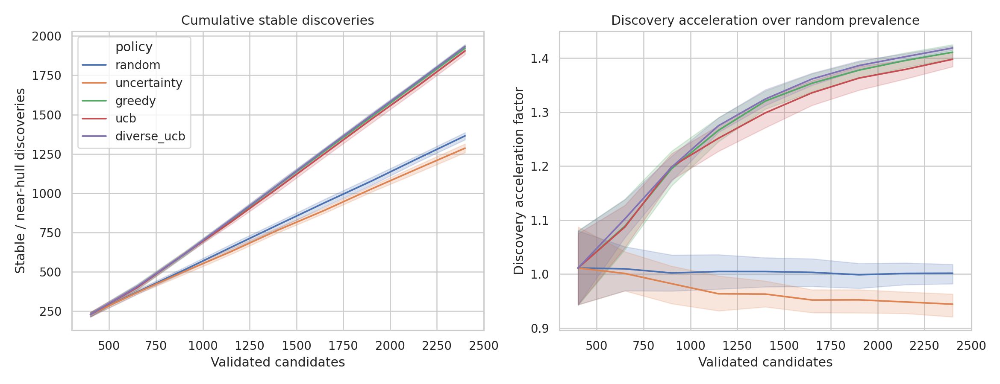
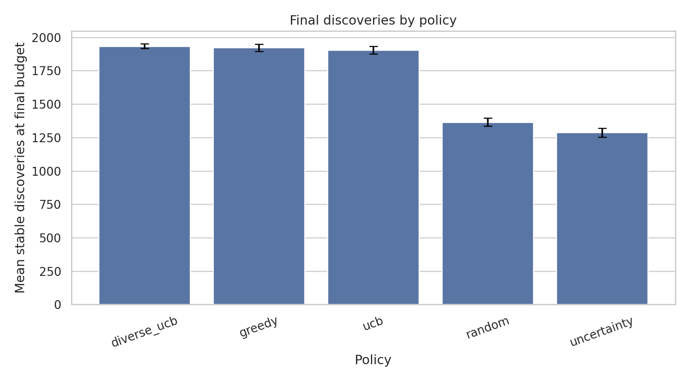
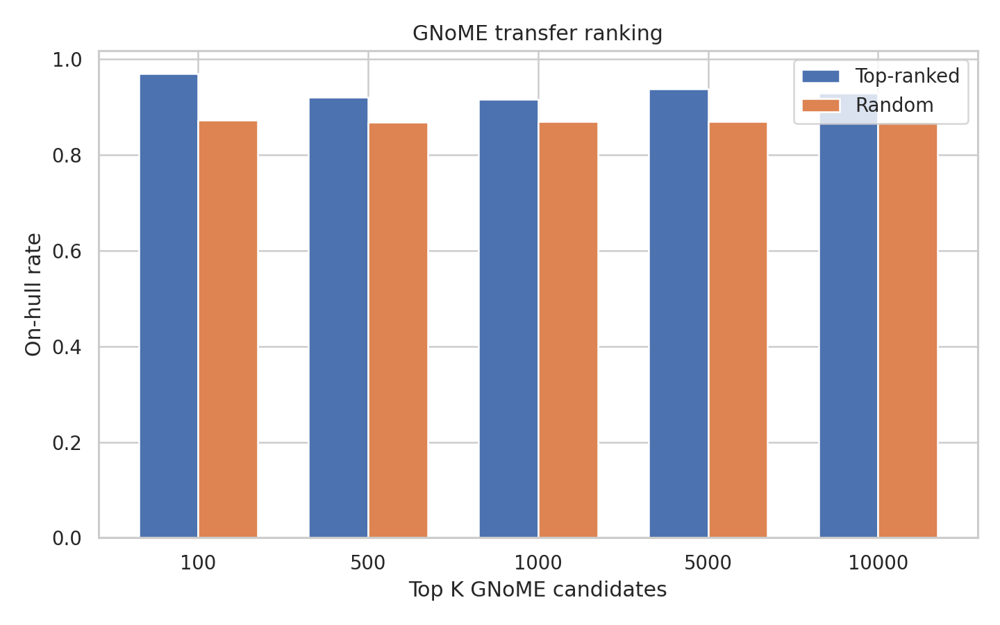

# Beyond Trial and Error: AI-Driven Invention Through Atomic Modeling

## 1. Executive Summary

This study tested whether an autonomous, structured experimental loop can discover stable inorganic material combinations more efficiently than random trial-and-error under a fixed validation budget. Using real Materials Project energy-above-hull labels as an offline oracle, the best structured policy found 1,933 stable or near-hull candidates on average, compared with 1,365 for random selection at the same 2,400-candidate validation budget.

The result supports the narrow operational form of the hypothesis: AI-guided triage can systematically prioritize promising atomic combinations. It does not prove autonomous invention in the full physical sense, because no new DFT calculations, synthesis, or experimental characterization were performed.

Practical implication: a surrogate-guided discovery loop can reduce wasted validation effort by roughly 40% in this offline benchmark, but final invention claims still require higher-fidelity validation and audited novelty/synthesizability checks.

## 2. Research Question & Motivation

**Research question:** Can an intelligent, structured experimental loop use atomic composition and structure descriptors to discover stable or near-hull inorganic materials more efficiently than random trial-and-error?

The broader user hypothesis is that invention can be systematized by intelligently recombining existing elements of nature. In materials science, this maps to generating or enumerating atomic combinations, predicting which are stable, validating selected candidates, and iterating.

The gap identified in `literature_review.md` is that modern systems such as GNoME, MatterGen, CHGNet, MACE-MP, OMat24, Matbench Discovery, LLMatDesign, and A-Lab show major progress, but robust autonomous discovery still depends on validation quality, novelty checks, uncertainty, and synthesis evidence.

## 3. Methodology

### Datasets

| Dataset | Use | Rows used | Notes |
|---|---:|---:|---|
| Materials Project HF | Primary active-discovery oracle | 129,622 | 3,798 rows with missing energy-above-hull were excluded |
| GNoME R2SCAN summaries | External transfer ranking | 139,541 | Used decomposition energy as an external stability proxy |
| Literature/code resources | Design context | 14 papers, 8 repos | Reviewed before planning |

Primary label: stable or near-hull if `energy_above_hull <= 0.05 eV/atom`. This threshold follows common computational materials practice for near-hull triage. For the stricter GNoME transfer check, on-hull means `Decomposition Energy Per Atom <= 0.0`.

### Features

The model used leakage-controlled candidate descriptors:

- 118 element-fraction features.
- Composition summaries: atom count, number of elements, entropy, max/min element fraction, weighted atomic number statistics, period/block summaries.
- Materials Project active loop only: coarse cell descriptors such as volume, volume per atom, cell lengths, aspect ratio, and angles.

Energy-like columns including energy per atom, formation energy, energy above hull, and decomposition energy were excluded from model inputs.

### Models and Policies

The surrogate was a small PyTorch MLP classifier trained on GPU 0 with mixed precision where CUDA was available. Training batch size was 128; inference batch size was 8,192.

Active-discovery protocol:

- Candidate pool: 25,000 Materials Project rows per seed.
- Initial random observations: 400.
- Acquisition: 8 rounds of 250 candidates.
- Total validation budget: 2,400 candidates per seed.
- Seeds: 5.

Policies compared:

| Policy | Description |
|---|---|
| Random | Uniform trial-and-error baseline |
| Uncertainty | Selects candidates near classifier uncertainty |
| Greedy | Selects highest predicted stability probability |
| UCB | Selects predicted probability plus uncertainty bonus |
| Diverse UCB | Selects high UCB-score candidates while spreading across composition space |

### Statistical Plan

Main endpoint: final cumulative stable discoveries at budget 2,400. Policies were compared against random using paired tests across identical seeds. Shapiro-Wilk tests checked paired differences; paired t-tests were selected for the main comparisons. Holm correction was applied across policy-vs-random tests.

### Environment

Run time was 164.5 seconds. PyTorch used CUDA on one NVIDIA RTX A6000 GPU. The workspace `.venv` recorded dependencies in `pyproject.toml`.

Key versions:

- Python 3.12.8
- NumPy 2.4.6
- pandas 3.0.3
- PyTorch 2.12.0+cu130
- scikit-learn 1.9.0
- SciPy 1.17.1

Full environment metadata: `results/environment.json`.

## 4. Results

### Data Audit

| Quantity | Value |
|---|---:|
| Materials Project raw rows | 133,420 |
| Materials Project labeled rows used | 129,622 |
| Missing energy-above-hull rows excluded | 3,798 |
| Stable or near-hull rows | 73,630 |
| Stable prevalence | 56.80% |
| GNoME R2SCAN rows | 139,541 |
| GNoME on-hull prevalence | 86.96% |
| GNoME near-hull prevalence | 98.41% |

### Predictive Signal

The surrogate had useful stability-ranking signal even with simple descriptors.

| Feature set | ROC-AUC | Average precision | F1 | Precision | Recall |
|---|---:|---:|---:|---:|---:|
| Composition only | 0.846 | 0.865 | 0.809 | 0.756 | 0.871 |
| Composition plus cell | 0.874 | 0.891 | 0.828 | 0.779 | 0.883 |



### Active Discovery

At the same 2,400-candidate validation budget, structured policies substantially outperformed random selection.

| Policy | Mean stable found | Mean precision | Mean discovery acceleration | Mean stable recall |
|---|---:|---:|---:|---:|
| Diverse UCB | 1,933.2 | 0.8055 | 1.4186 | 0.1362 |
| Greedy | 1,922.6 | 0.8011 | 1.4108 | 0.1354 |
| UCB | 1,904.8 | 0.7937 | 1.3977 | 0.1342 |
| Random | 1,364.8 | 0.5687 | 1.0015 | 0.0961 |
| Uncertainty | 1,286.6 | 0.5361 | 0.9442 | 0.0906 |





### Statistical Tests

| Comparison | Mean stable-discovery difference | 95% CI | Cohen's d | Holm-adjusted p |
|---|---:|---:|---:|---:|
| Diverse UCB vs random | +568.4 | [524.0, 612.8] | 15.90 | 1.05e-05 |
| Greedy vs random | +557.8 | [514.9, 600.7] | 16.16 | 1.05e-05 |
| UCB vs random | +540.0 | [515.3, 564.7] | 27.19 | 1.75e-06 |
| Uncertainty vs random | -78.2 | [-129.8, -26.6] | -1.88 | 0.0136 |

The model-guided policies were significantly better than random. Pure uncertainty sampling was significantly worse, showing that exploration without a reward-oriented objective is not enough for discovery.

### GNoME Transfer Ranking

The composition-only Materials Project model was applied to GNoME R2SCAN summaries. Because GNoME is already heavily enriched for stable materials, near-hull rates were close to saturated; the stricter on-hull rate is more informative.

| Top K | Top on-hull rate | Random on-hull rate | On-hull acceleration | Top mean decomposition energy |
|---:|---:|---:|---:|---:|
| 100 | 0.970 | 0.8735 | 1.115 | -0.1288 |
| 500 | 0.920 | 0.8691 | 1.058 | -0.0801 |
| 1,000 | 0.917 | 0.8702 | 1.055 | -0.0722 |
| 5,000 | 0.937 | 0.8697 | 1.078 | -0.0606 |
| 10,000 | 0.929 | 0.8697 | 1.068 | -0.0586 |



### Reproducibility

The built-in deterministic mini-rerun repeated the greedy policy on the same seed and obtained identical traces:

```json
{
  "policy": "greedy",
  "seed": 13,
  "same_trace": true,
  "first_final_stable_found": 272,
  "second_final_stable_found": 272
}
```

## 5. Analysis & Discussion

The results support H1 and H2. The surrogate learned meaningful stability signal, and model-guided acquisition improved stable-material discovery under a fixed budget. This is the computational analogue of systematized invention: instead of trying combinations blindly, the system uses prior evidence to decide which combinations to validate next.

H3 is partially supported. Diverse UCB had the highest mean final discovery count, but it was only modestly above greedy exploitation. This suggests that chemical diversity helps avoid narrow exploitation, but the current experiment did not include enough seeds to claim a strong difference between the model-guided policies themselves.

H4 is weakly but positively supported. The Materials Project composition model improved GNoME on-hull ranking, especially in the top 100 candidates. Transfer gains were modest because GNoME R2SCAN summaries are already enriched: 86.96% are on-hull and 98.41% are near-hull by the thresholds used here.

The biggest negative result is uncertainty sampling. Selecting ambiguous candidates produced fewer discoveries than random, which is a useful warning for autonomous labs: uncertainty reduction and discovery maximization are different objectives.

## 6. Limitations

- This was an offline benchmark, not a live autonomous lab.
- The oracle was precomputed energy-above-hull data, not new DFT, synthesis, or characterization.
- Stability is only one invention-relevant objective; usefulness, synthesizability, toxicity, cost, and manufacturability were not measured.
- Materials Project pools had high stable prevalence, so future work should test harder, lower-prevalence candidate spaces.
- GNoME transfer used composition-only descriptors because full structures were not locally mirrored.
- The model was a simple MLP, not CHGNet, MACE-MP, UMA, MatterGen, or a full Matbench Discovery workflow.
- Only five active-learning seeds were run; paired effects against random were very large, but smaller policy-to-policy differences need more runs.
- Database novelty was not audited against disorder, polymorphism, or post-release entries.

## 7. Conclusions & Next Steps

The core finding is that structured autonomous selection can discover stable atomic combinations much more efficiently than random trial-and-error in a real offline materials benchmark. This supports the operational premise behind AI-driven invention, while also showing that prediction is only a triage layer and cannot by itself establish a breakthrough invention.

Recommended next steps:

1. Replace the lightweight MLP with CHGNet, MACE-MP, or OMat24-derived models and evaluate on Matbench Discovery.
2. Add a generative candidate source such as MatterGen, then run stability, novelty, duplicate, oxidation-state, and synthesizability filters.
3. Calibrate uncertainty and compare acquisition functions on lower-prevalence candidate pools.
4. Reserve high-fidelity DFT calculations or experimental validation for top candidates before making any novelty or invention claims.

## 8. Output Files

| File | Purpose |
|---|---|
| `src/run_discovery_experiments.py` | Main experiment and analysis code |
| `planning.md` | Preregistered motivation, novelty, and experimental plan |
| `results/data_audit.json` | Dataset validation summary |
| `results/predictive_metrics.csv` | Surrogate predictive metrics |
| `results/active_learning_trace.csv` | Per-round active-learning results |
| `results/active_learning_summary.csv` | Final policy summaries |
| `results/stat_tests.csv` | Statistical tests |
| `results/gnome_transfer_summary.csv` | GNoME transfer ranking summary |
| `results/gnome_ranked_candidates.csv` | Ranked GNoME candidate list |
| `results/reproducibility_check.json` | Deterministic mini-rerun result |
| `figures/*.png` | Report visualizations |

## 9. References

- Merchant et al. 2023. GNoME: Scaling deep learning for materials discovery.
- Riebesell et al. 2023/2024. Matbench Discovery.
- Barroso-Luque et al. 2024/2026. OMat24.
- Zeni et al. 2023/2025. MatterGen.
- Deng et al. 2023. CHGNet.
- Batatia et al. 2024. MACE-MP.
- Chen and Ong 2022. M3GNet.
- Szymanski et al. 2023 and Nature correction 2026. A-Lab.
- Jia, Zhang, and Fung 2024. LLMatDesign.
- Local resource details: `literature_review.md`, `resources.md`, `papers/`, `datasets/`, and `code/`.
